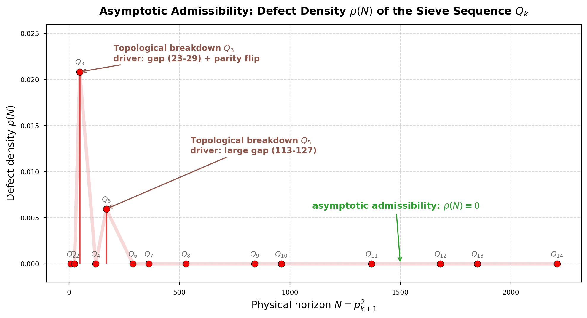
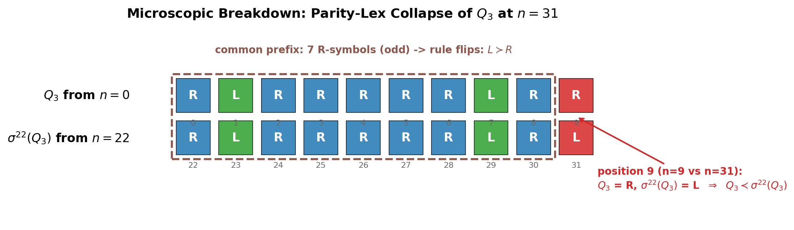
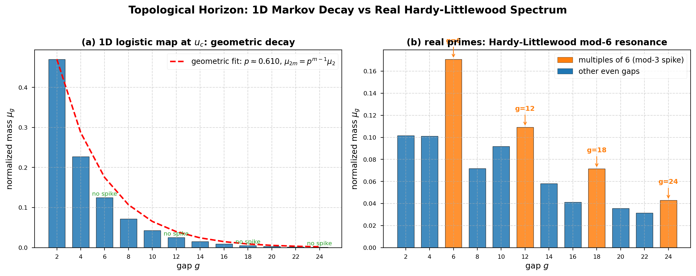
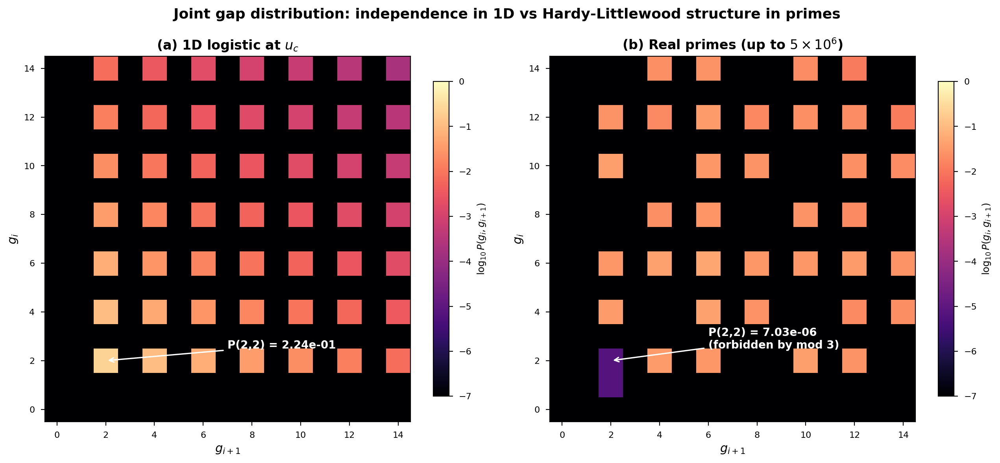

# Prime Dynamics

Companion repository for the manuscript

> **Transient Chaos and Topological Bounds in Prime Dynamics: Revisiting the One-Dimensional Sieve Mapping**
> Liang Wang
> Submitted to *Ergodic Theory and Dynamical Systems* (ETDS-2026-0159), May 2026.

This repository contains the LaTeX source, all numerical experiments, the figure-generation scripts, and six companion Jupyter notebooks reproducing the headline numerical claims of the paper.

<p align="center">
  
  <br>
  <em>Topological-defect density $\rho(N)$ for $Q_k$, $k = 1, \ldots, 14$. Defects appear only at $Q_3$ (parity flip at $n = 31$) and at $Q_5$ (the 113–127 prime gap), and are exactly $0$ for every other stage in $k \leq 5000$.</em>
</p>

## What's in the paper

The paper studies the symbolic dynamics of the Eratosthenes sieve under the Metropolis–Stein–Stein (MSS) kneading admissibility framework, taking as starting object the matching between the sieve word $Q_k = \prod_{j \le k} S_{p_j}$ and admissible itineraries of the unimodal map $x \mapsto 1 - u x^2$ at the band-merging parameter $u_c \approx 1.5436890$. Two unconditional theorems anchor the contribution.

- **Parity-Gap Lemma (Theorem A)**. Any defective shift of $W_k = Q_k[0, p_{k+1}^2)$ forces a prime gap of length $\geq p_{k+1} - 1$ at a specific position. This reduces topological admissibility to an extremal prime-gap inequality $G(p_{k+1}^2) < p_{k+1} - 1$. Classical bounds (Legendre, Andrica, RH, BHP) all fail to clear it; only a strongly sub-root bound such as Cramér's conjecture forces eventual admissibility.

- **Even-gap rigidity (Theorem B)**. At $u_c$, every gap between consecutive $L$-symbols is even, $\mu$-almost surely.

- **Asymptotic geometric decay (Theorem C, conditional on standard spectral lemmas)**. A four-state parity-split chain forces $\mu_{2m+2}/\mu_{2m} \to p_\infty \approx 0.596$, ruling out internal mod-3 resonance and identifying the unimodal projection as an abelian / mod-2 shadow of the prime distribution.

The paper closes with a clearly conditional reduction connecting recurrence to the L-R-L cylinder under the unimodal flow to a precisely stated arithmetic shadowing problem.

<table>
<tr>
<td align="center" width="33%">
<br>
<em>Microscopic breakdown</em><br>
<sub>$Q_3$ vs $\sigma^{22}(Q_3)$: 7 R's in the prefix flip the parity-twisted lex rule; the candidate emits R at $n=31$ but $Q_3$ emits L (since 31 is prime), so $Q_3 \prec \sigma^{22}(Q_3)$ — admissibility fails.</sub>
</td>
<td align="center" width="33%">
<br>
<em>Geometric decay vs HL spectrum</em><br>
<sub>Left: 1D logistic at $u_c$ has clean asymptotic geometric decay $\mu_{2m} \sim c\,p_\infty^m$. Right: real primes show Hardy-Littlewood resonance at multiples of 6 — provably outside the model's reach.</sub>
</td>
<td align="center" width="33%">
<br>
<em>Joint gap mod-3 absence</em><br>
<sub>$P(g_i, g_{i+1})$ heatmaps. The 1D model factorises (rank-1); real primes show a diagonal mod-6 structure with $(2,2)$ extinct beyond the singleton triplet $(3,5,7)$.</sub>
</td>
</tr>
</table>

## Repository layout

```
prime_math/
├── paper/                       LaTeX manuscript
│   ├── main.tex + main.pdf      Generic article-class version (25 pages)
│   ├── paper-ets/               ETDS journal-formatted version (28 pages)
│   ├── paper-ets.zip            Self-contained ETDS submission package
│   └── cover_letter_etds.{tex,pdf}
│
├── src/                         Canonical Python implementations
│   ├── mss.py / mss_jit.py      Parity-twisted lex MSS comparator
│   ├── sieve.py                 Q_k generation
│   ├── logistic.py              Unimodal map iteration + symbolic encoding
│   └── gap_spectrum.py          Gap statistics utilities
│
├── experiments/                 13 self-contained experiment scripts
│   ├── exp1_*.py                Defect density sweep up to k = 5000
│   ├── exp2_*.py                Logistic gap spectrum (5e8 iterations)
│   ├── exp3_real_prime_gaps.py  Real prime gap reference
│   ├── exp4*.py                 Markov chain / Perron-Frobenius
│   ├── exp5_natural_primes.py   Natural prime sequence admissibility
│   ├── exp6_shield_depth.py     Mean shift-match depth d_k
│   ├── exp7_twin_excess.py      Twin pair excess
│   ├── exp8_parity_gap_lemma.py Parity-Gap Lemma verification
│   ├── exp9_twin_decomposition.py
│   ├── exp10_nonautonomous_C2.py
│   ├── exp11_triplets.py
│   └── exp12_quadruplets.py
│
├── figures/                     Figure scripts and PNGs
│
├── notebooks/                   6 themed companion Jupyter notebooks
│   ├── 00_overview.ipynb
│   ├── 01_microscopic_breakdown.ipynb
│   ├── 02_parity_rigidity_decay.ipynb
│   ├── 03_twin_constellations.ipynb
│   ├── 04_natural_primes.ipynb
│   └── 05_shield_depth.ipynb
│
├── results/                     Cached numerical outputs (CSV/JSON)
│
├── AUTO_REVIEW.md               Three-round self-review record (R1+R2+R3)
├── PROJECT.md                   Internal project notes
├── discussion_log.md            Early planning and discussion log
├── gpt_result.md                Parity-Gap Lemma derivation history
└── review1.md                   External pre-submission review
```

## Quick start

```bash
git clone https://github.com/maris205/prime_dynamics.git
cd prime_dynamics

# Install dependencies (numpy, sympy, matplotlib, numba, scipy)
pip install -r requirements.txt   # if you make one; otherwise install ad hoc

# Run a single experiment
python experiments/exp1_defect_density.py

# Or open a companion notebook (each one is self-contained)
jupyter notebook notebooks/02_parity_rigidity_decay.ipynb
```

## Reproducing the headline results

| Result | How to reproduce |
|---|---|
| $Q_3$ defect at $n = 31$ | `notebooks/01_microscopic_breakdown.ipynb` (~5 s) |
| $Q_5$ defect at gap 113–127 | same notebook |
| Defect-density sweep $k \le 5000$ | `experiments/exp1_large.py` (~100 min) |
| Even-gap rigidity at $u_c$ | `notebooks/02_parity_rigidity_decay.ipynb` (~30 s) |
| Successive ratios $\mu_{2m+2}/\mu_{2m} \to 0.596$ | same notebook |
| Joint constellation absence of mod-3 resonance | `notebooks/03_twin_constellations.ipynb` (~1 min) |

## LaTeX build

The generic version uses standard `pdflatex`:

```bash
cd paper
pdflatex main && bibtex main && pdflatex main && pdflatex main
```

The ETDS-formatted version requires `texlive-fonts-extra` for `newtxmath`:

```bash
sudo apt install texlive-fonts-extra   # one-time
cd paper/paper-ets
pdflatex main && bibtex main && pdflatex main && pdflatex main
```

## Citation

If you use this code or paper, please cite:

```bibtex
@article{wang2026prime_dynamics,
  title   = {Transient Chaos and Topological Bounds in Prime Dynamics:
             Revisiting the One-Dimensional Sieve Mapping},
  author  = {Wang, Liang},
  journal = {Ergodic Theory and Dynamical Systems (under review)},
  year    = {2026},
  note    = {Manuscript ID ETDS-2026-0159. Code:
             \url{https://github.com/maris205/prime_dynamics}}
}
```

## License

Code: MIT License. Manuscript: © the author and subject to the publisher's policies once accepted.

## Related work

- Wang, L. (2026). *The Emergence of Prime Distribution from Low-Dimensional Deterministic Chaos*. Preprint, [DOI 10.5281/zenodo.18439638](https://doi.org/10.5281/zenodo.18439638). Companion code: [maris205/prime_logistic](https://github.com/maris205/prime_logistic). The matching between $Q_k$ and the unimodal map analysed in the present paper was originally proposed there.
